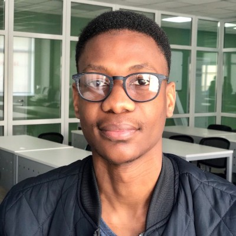

# ACML Project

The project for AC & ML requires you to analyse a dataset using machine learning techniques and present your methods and results. The specification can be found [here](./specification/ACML%20Project%202025.pdf).

## Team

|    [Bongani Shube](https://www.linkedin.com/in/bonganishube/) |    [Jason Wille](https://www.linkedin.com/in/jasonwille97/) |    [Preshen Goobiah](https://www.linkedin.com/in/preshen-goobiah-aa6b92149/) |
| :--------------------------------------------------------------------------------------------------------------------: | :------------------------------------------------------------------------------------------------------------: | :---------------------------------------------------------------------------------------------------------------------------------------: |
